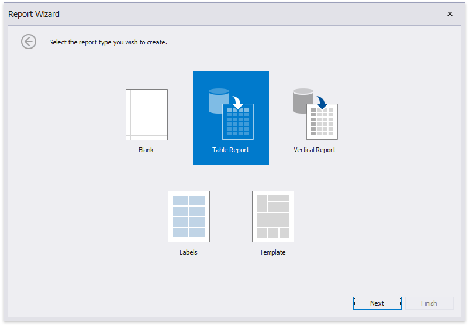

# Report Wizard

The Report Wizard allows you to add a report using one of the following templates:

* [Blank](report-wizard\blank-report.md)
	
	Creates a new blank report that is not bound to a data source. Choose this option to design your report without using the wizard.
* [Table Report](report-wizard\table-report.md)
	
	Allows you to create a [table report](..\create-popular-reports\create-a-table-report.md), connect it to a data source and configure basic report layout settings.
* [Vertical Report](report-wizard\vertical-report.md)
	
	Allows you to create a [vertical report](../create-popular-reports/create-a-vertical-report.md), connect it to a data source and configure basic report layout settings.	    
* [Template](report-wizard\template.md)
	
	Enables you to create a new report based on available predefined templates.
* [Labels](report-wizard\labels.md)
	
	Allows you to select from different customizable layouts to create labels, badges or price tags.

## Run the Report Wizard

Use one of the following ways to invoke the Report Wizard.

- Create a new report

    Use the [New Report via Wizard](../add-new-reports.md) command to create a new report based on a Report Wizard template.

- Edit an existing report

    Click the report's Smart Tag and then the **Design in Report Wizard...** context link in the invoked actions list.

    > [!Note]
    > The new report layout overrides the initial report layout.

