# Property Grid

The **Property Grid** allows you to access and customize the report's and report elements' settings.

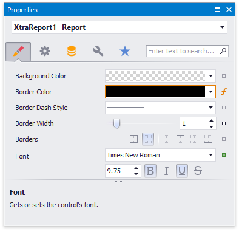

## Select a Report Element
Do one of the following to select an element and show its properties in the Property Grid:

* Select a required element in the drop-down list at the top of the Property Grid.
	
	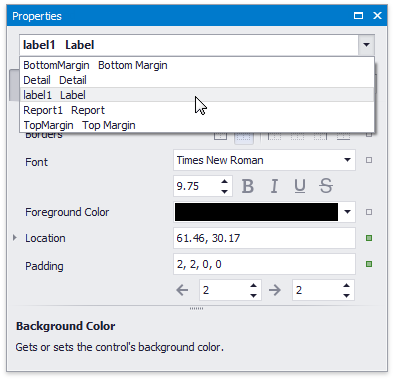
* Click a required element in the [design surface](../../first-look-at-the-report-designer.md).
* Select a required element in the [Report Explorer](report-explorer.md).

## Property Grid Tabs

The Property Grid displays properties in tabs.

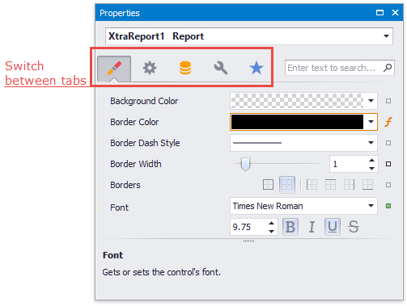

## Display Favorite Properties

The **Favorites** tab displays favorite or most frequently used properties.

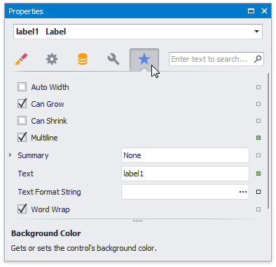

Click the **Edit Favorite Properties** context menu item to set up the favorite properties. In the invoked **Favorite Properties Editor**, enable check boxes for the controls' properties to include these properties to the favorite list.

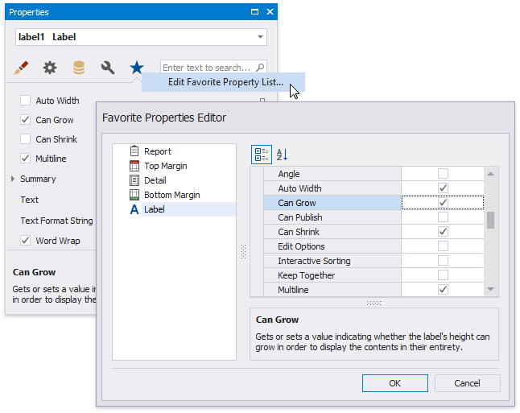

## Change Property Values

The Property Grid displays a green marker if a property's default value changes.

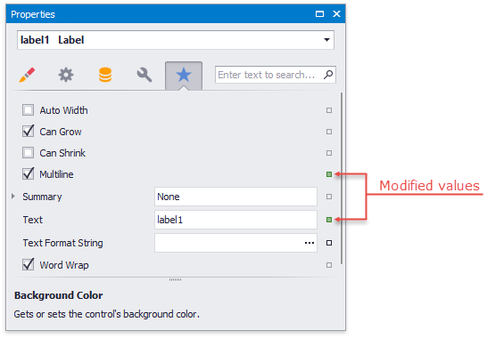

Right-click a property's editor to reset the value.

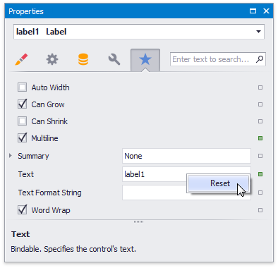

## Specify Expressions

If [expression bindings](../../bind-to-data/data-binding-modes.md) are enabled, the Property Grid allows you to specify expressions that can include two or more data fields and various functions. Click a property marker to see whether the invoked context menu has the **PropertyName Expression** item. 

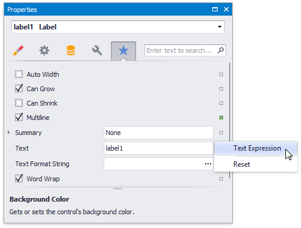

Click this item to specify an expression in the invoked Expression Editor.

The Property Grid highlights properties that have an assigned expression.

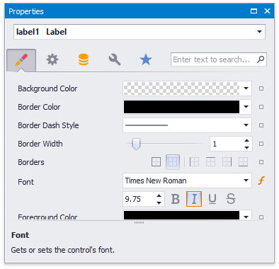

Click a property's marker and choose **Reset** to reset the property value.

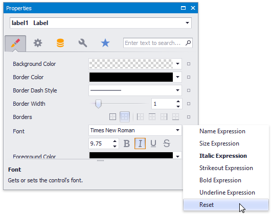

> [!Note]
> The **Reset** command resets the both the expression and the value you specified using the property editor.

## Search Properties

The Property Grid's search box allows you to search for a property. When you type within the search box, the Property Grid automatically creates a search criteria based on the entered text and filters the list of available properties.

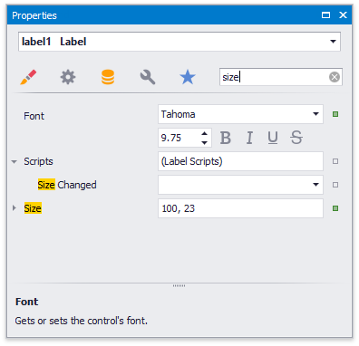

If you type two substrings separated by a space character, these substrings are considered as individual conditions combined by the OR logical operator. To find properties that contain both substrings (i.e., to use the AND logical operator), enclose the entered string in quotation marks.

