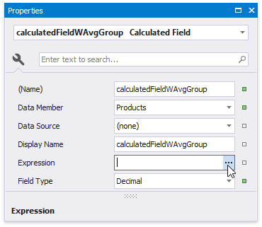

# Calculate a Weighted Average Function

This tutorial demonstrates how to calculate a weighted average function in a report, for instance, calculate a weighted average price for the units in stock within each product category: _Sum (Unit Price * Units In Stock) / Sum (Units In Stock)_.

## Use Report Summary Functions (Recommended)
You can calculate a weighted average at report level by specifying a control's expression using several built-in report summary functions.

> [!NOTE]
> You can use this approach if expression bindings **are enabled** in the Report Designer (the [Property Grid](../../report-designer-tools/ui-panels/property-grid.md) provides the **Expressions**  tab).
> 
> See the next document sections to learn about alternative approaches.

1. [Open an existing report](../../open-reports.md) or [create a new one from scratch](../../add-new-reports.md).
2. [Bind a report](../../bind-to-data.md) to a required data source. 
3. [Group the report's data](../../shape-report-data/group-and-sort-data/group-data.md) using the [Group and Sort Panel](../../report-designer-tools/ui-panels/group-and-sort-panel.md) and construct a layout like the following:
	
	

4. Add the [Group Footer](../../introduction-to-banded-reports.md) band to the report and drop a [Label](../../use-report-elements/use-basic-report-controls/label.md) control on this band to display the summary result.
	
	Click the label's smart tag and set its **Summary Running** property to **Group**.
	
	

5. Click the **Expression** property's ellipsis button. This invokes the **Summary Expression Editor** where you can specify a custom expression with multiple built-in functions from the **Functions** | **Summary** section. Report summary functions start with the "sum" prefix to help differentiate them from aggregate functions.
	
	

6. You can also use the control's **Format String** property to format the summary's value. For instance, set this property to **Weighted Average Price: {0:c2}**.

## Use Aggregate Functions
You can create a [calculated field](calculated-fields-overview.md) and use a standard aggregate function in its expression to evaluate a weighted average at the report level.

1. [Open an existing report](../../open-reports.md) or [create a new one from scratch](../../add-new-reports.md).
2. [Bind a report](../../bind-to-data.md) to a required data source and construct the required report layout.
3. Right-click any item in the [Field List](../../report-designer-tools/ui-panels/field-list.md)'s data source node, and in the invoked context menu, select **Add Calculated Field**.
	
	
4. Select the created calculated field and switch to the [Property Grid](../../report-designer-tools/ui-panels/property-grid.md). Specify the **Name** property, set the **Field Type** to **Decimal** and click the **Expression** property's ellipsis button.
	
	
5. In the invoked **Expression Editor**, specify the expression using the **Sum** aggregate function. For example:
	
	_[][[CategoryID] == [^.CategoryID]].Sum([UnitPrice] * [UnitsInStock])  / [][[CategoryID] == [^.CategoryID]].Sum([UnitsInStock])_
	
	
	
	To construct a valid aggregate expression, use the following format, which consists of four parts.

    _[\<Collection>][\<Condition>].\<Aggregate>(\<Expression>)_

    * _\<Collection>_ - Specifies a collection against which an aggregated value should be calculated. It can be the relationship name in a case of a master-detail relationship, or the name of a collection property exposed by the target class. For example, _[CategoriesProducts][[CategoryId]>5].Count()_. Empty brackets [] indicate the root collection.
    * _\<Condition>_ - Specifies a condition defining which records should participate in calculating an aggregate function. To obtain an aggregated value against all records, delete this logical clause along with square brackets (for example, _[].Count()_).
    * _\<Aggregate>_ - Specifies one of the available aggregate functions.
    * _\<Expression>_ - Specifies an expression evaluating values to be used to perform calculation. For example, _[][[CategoryID] > 5].Sum([UnitPrice]*[Quantity])_. The **Count** function does not require field values to count the records, so leave the round brackets empty for this function.

    You can refer to the currently processed group using the Parent Relationship Traversal Operator ('^'). This allows you to calculate aggregates within groups using expressions like the following: _[][[^.CategoryID] == [CategoryID]].Sum([UnitPrice])_.

    For more information, see [Expression Syntax](../../use-expressions/expression-syntax.md).

6. Add the created calculated field to the report as an ordinary data field and format its value.

## Calculate at Data Source Level
You can calculate summaries at data source level using a **SqlDataSource** component and use them in a report as regular data fields. Then, create a [calculated field](calculated-fields-overview.md) with an appropriate expression utilizing these fields.

1. When creating a new data-bound report using the [Report Wizard](../../report-designer-tools/report-wizard.md) or [binding an existing one to an SQL data source](../../bind-to-data.md), go to the [query customization](../../report-designer-tools/data-source-wizard/connect-to-a-database/create-a-query-or-select-a-stored-procedure.md) page. On this page, click the plus button for the **Queries** category to create a new query using the [Query Builder](../../report-designer-tools/query-builder.md).
	
	
	
	To customize an existing data source, right-click the data source in the [Report Explorer](../../report-designer-tools/ui-panels/report-explorer.md) or [Field List](../../report-designer-tools/ui-panels/field-list.md) and select **Manage Queries...** in the context menu.
	
	
	
	In the invoked **Manage Queries** dialog, click the required query's ellipsis button.
	
	
	
	In the invoked wizard page, select the **Query** option and click the **Run Query Builder...** button.
	
	
2. In the **Query Builder**, add the required tables to a query and enable checkboxes for the field you want to include in the query.
	
	
3. In the column list under the data source editor, apply grouping and the **Sum** aggregate function to the field that stores the units in stock.
	
	
4. Specify an expression for a new column by clicking the corresponding ellipsis button. In the invoked **Expression Editor**, specify an expression that multiplies the unit price and the units in stock as in the following image:
	
	
5. Apply the **Sum** aggregation function to the previously created column as well.
	
	The image below demonstrates the resulting query.
	
	
6. Click **OK** to complete the **Query Builder**, and then click **Finish** to exit the wizard.
7. Go to the **Field List**, right-click any item inside the data source node, and in the invoked context menu, select **Add Calculated Field**.
	
	
8. Right-click the created calculated field and select **Edit Expression...**.
	
	
9. In the invoked **Expression Editor**, construct the following expression and click **OK**:
	
	
10. Add the created calculated field to the report as an ordinary data field and format its value.