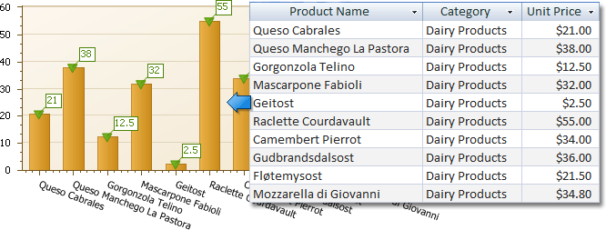
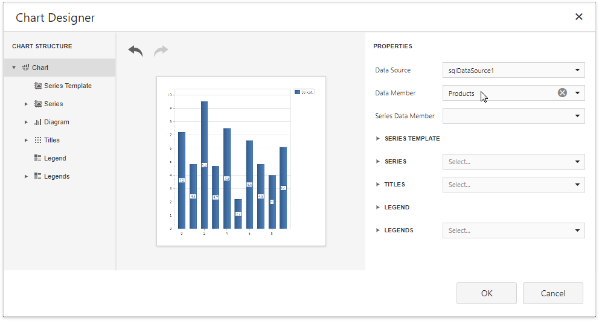
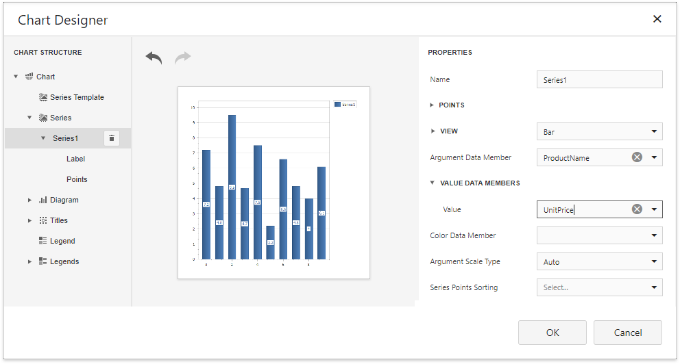
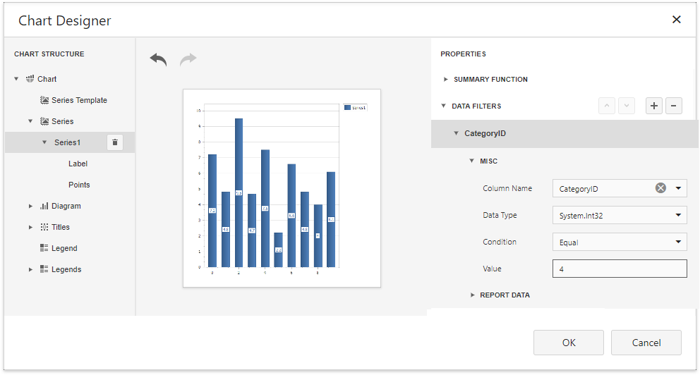

# Add a Chart (Set Up Series Manually)

This document describes how to add a chart to a report, provide data for the chart series, and set up a chart's elements. In this example, series data has a single data source. You can also use different data sources for different series.

## Add a Chart to a Report

1. Drop the **Chart** control from the [Toolbox](../../report-designer-tools/toolbox.md) onto the [Detail band](../../introduction-to-banded-reports.md).

    

2. Click **Run Designer...** to invoke the Chart Designer.

    

3. Specify the **Data Source** and **Data Member** properties to bind the chart to data.
	
	

> [!NOTE]
> The report's **Data Source** property should be set to **None** because you placed the Chart in the Detail band. When a report has its **Data Source** property specified, the Chart is repeated in the preview as many times as there are records in the report's data source.

## Add Series to the Chart

1. Locate the **Series** element in the chart elements tree and click the plus button. Select the type (for example, **Bar**) in the invoked series type list.

    

3. Specify the **Argument Data Member** and **Value** properties to populate the created series with points.

    

4. Expand the **Data Filters** category and click the plus button to add a new data filter. Adjust the filter criteria in the **Misc** node.

    

5. Create another series with the same settings. For instance, select the **Point** view type for this series.

6. You can do the following to see how the chart looks when it is populated with data:

    * save changes made in the Chart Designer;
    * close the Chart Designer;
    * switch to [Print Preview](../../preview-print-and-export-reports.md).
    * Return to the Report Designer and invoke the Chart Designer. The chart axes are now populated with actual data, and you can customize the chart.

## Customize the Chart

Apply the following adjustments to improve the chart's appearance:

* Remove the chart's legend (the chart series are bound to the same data).

	- Select **Legend** in the chart elements tree.
	- Disable the **Visibility** check box in the **Options** tab.

* Select the **Label** node under this series and disable the **Visibility** check box to hide **Series1**'s point labels.
* Customize the **Series2** markers' appearance. Set the **View.Point Marker Options.Kind** property to **InvertedTriangle** and **View.Point Marker Options.Size** to **12** to replace the default circle with an upside down triangle.
* Customize the chart's appearance settings. For instance, select **Nature Colors** in the **Palette**'s drop-down list.

## View the Result

Switch to [Print Preview](../../preview-print-and-export-reports.md) to see the resulting report.

